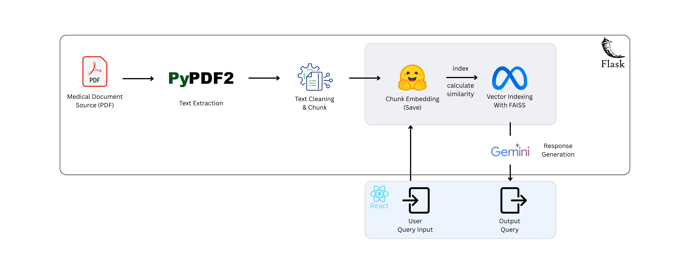
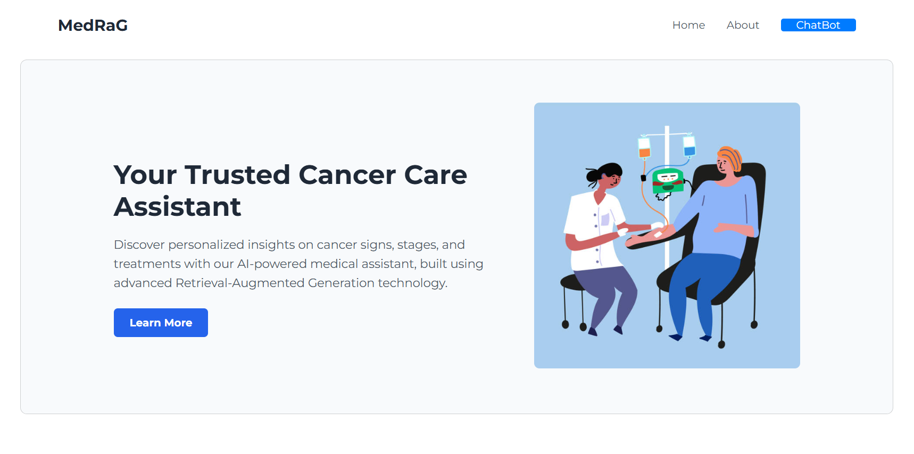

#  Cancer Treatment Assistant

The **Cancer Treatment Assistant** is an intelligent medical document question-answering system that helps users—patients, healthcare professionals, and researchers—extract relevant information from medical PDFs using natural language queries. It combines modern NLP techniques, vector search, and LLMs to provide accurate and contextual answers.

---

##  Overview

This system processes cancer-related documents, embeds them for semantic search, and retrieves relevant answers using an **all-MiniLM-L6-v2** Model.
It features a clean frontend interface and a robust Flask backend.

---

##  System Architecture

The architecture is composed of four main layers:



1. **Medical Document Ingestion**

   * Format: PDF
   * Extracted using `PyPDF2`

2. **Preprocessing & Chunking**

   * Chunked for better semantic retrieval
   * Embedded using Sentence Transformers

3. **Embedding & Indexing**

   * Indexed with FAISS for efficient vector search
   * Similarity-based retrieval

4. **Query Answering**

   * Query passed through FAISS retriever
   * Context fed to Gemini 1.5 Flash API
   * Generated answer returned to the user

---
## 📸 Screenshots

### 🏠 Landing Page



### 🤖 Chatbot Interface


---

##  Setup Instructions

### Backend Setup Instructions

To set up the backend, follow these steps:

1. Navigate to the backend folder:

   ```bash
   cd backend
   ```

2. Create a virtual environment:

   ```bash
   python -m venv venv
   ```

3. Activate the virtual environment:

   * On **Windows**:

     ```bash
     venv\Scripts\activate
     ```
   * On **macOS/Linux**:

     ```bash
     source venv/bin/activate
     ```

4. Install dependencies:

   ```bash
   pip install -r requirements.txt
   ```

5. Start the server:

   ```bash
   python manage.py runserver
   ```

---

### Frontend Setup Instructions

To set up the frontend, follow these steps:

1. Navigate to the frontend folder:

   ```bash
   cd frontend
   ```

2. Install Node.js dependencies:

   ```bash
   npm install
   ```

3. Start the development server:

   ```bash
   npm run dev
   ```


---

##  Technologies Used

* **Frontend**: React.js
* **Backend**: Flask
* **LLM**: Gemini 1.5 Flash API (Google)
* **Embeddings**: Sentence Transformers (`all-MiniLM-L6-v2`)
* **Indexing**: FAISS
* **Document Parsing**: PyPDF2

---

##  Features

* 🔍 Semantic Search on cancer treatment documents
* 💬 Ask questions in plain language
* ⚡ Fast and accurate retrieval with FAISS
* 📄 Works with PDF documents
* 🧠 Powered by all-MiniLM-L6-v2 & Gemini 1.5 Flash for rich, context-aware answers

---

##  License

This project is licensed under the MIT License.